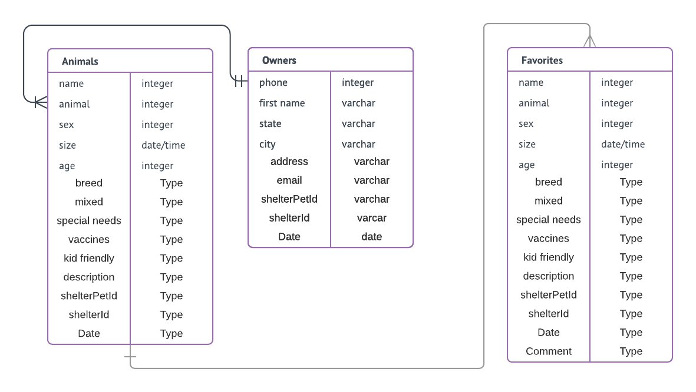
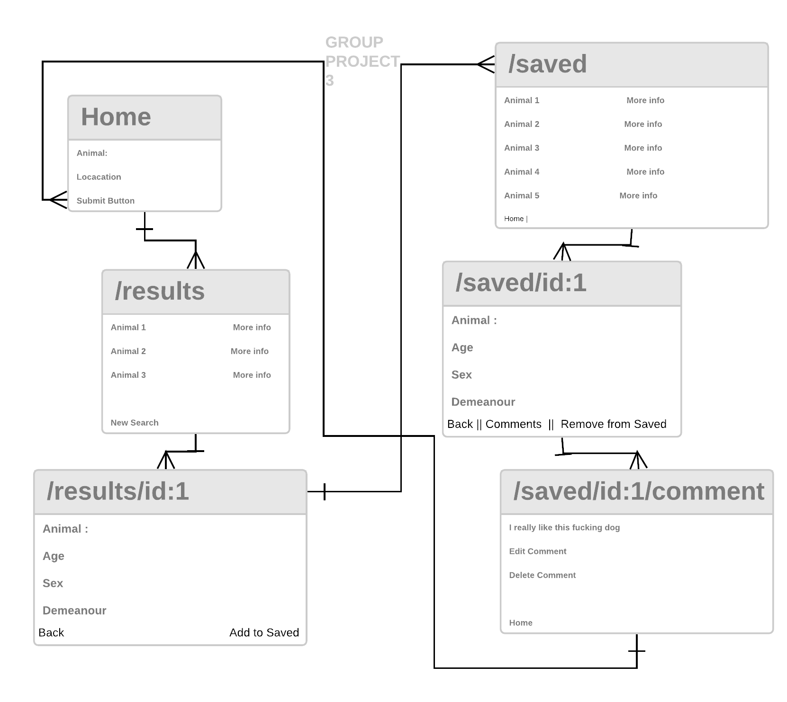
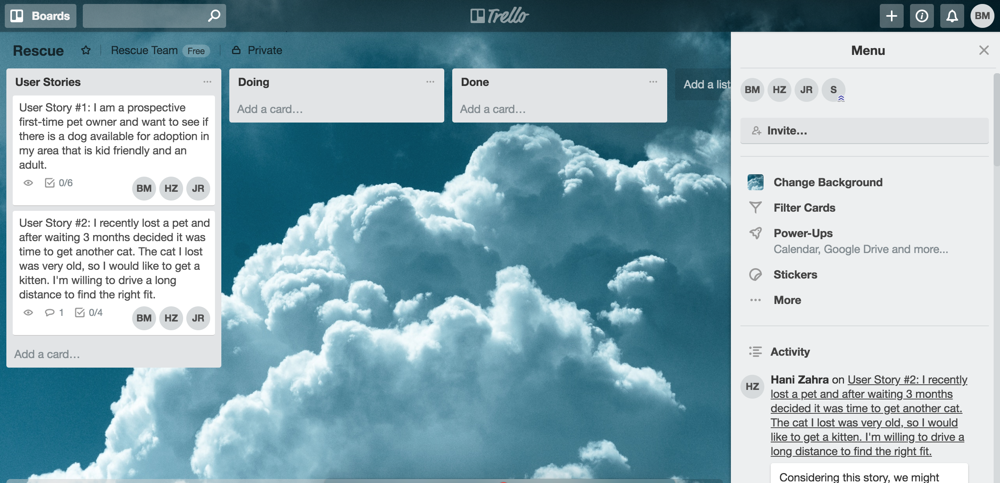
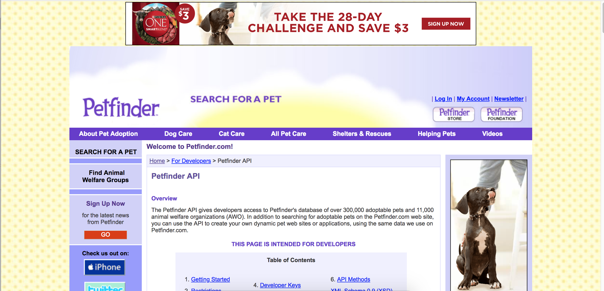

# Paws, Claws, Beaks Ohh Mine

Hani Zahra / Brian Martinez / Julius Regalado / Scott Schorn March 19, 2018 

## Rescue-Yours Proposal  
	"You can't change an animal's past, but you could rewrite their future"
	Rescue-Yours is our attempt at making a simple rescue pet finding application using an inputed location.
	A user will theoretically be able to input a location and pick from a drop down list of animals
	Once their results show, they can view the details of an animal and save them to their favorites. 
	A user will be able to upload and delete their own comments on their favorite animals.

## Entity Relationship Diagram

## Wireframe 

## User Stories  

## Technology

	https://www.petfinder.com/developers/api-docs
	  The Petfinder API gives developers access to Petfinder's database of over 300,000 adoptable pets and 11,000 animal welfare organizations (AWO). In addition to searching for adoptable pets on the Petfinder.com web site, you can use the API to create your own dynamic pet web sites or applications, using the same data we use on Petfinder.com.
    

## Extras
	Include sign up/log in functionality**, with encrypted passwords & authorization with bcrypt
	Being able to share to social media
	Hit more external API's (Watson, Trivia about animal(breed))
	Explore additional NPM packages
	features features features if team sanity/skill up to par

## Timeline
	Friday - Intial ReadMe, User Stories, Table/Schema Setup, API tinkering.
	Saturday - Copious Amounts of codingggg/ Leprachauns day of birfff
    Sinday - CODE
    _ Monday CODE
    _ Tuesday CODE
    _ Wednesday CODE/Life
    _ Thursday CODE
    _ Friday CODE
    _ Saturday FRANTICALLY CODE/Life
    _ Sunday FRANTICALLY CODE/Life
    _ Monday FRANTICALLY CODE until Presentation!

## Obstacles
	PAIN IS A WEAKNESS LEAVING YOUR BRAIN. TEAMWORK IS THE KEY

## Links and Resources   
https://github.com/hanizahra/petfinder

 
